RRA_project_29772
# Revenue Administration Database

## Overview

A PostgreSQL database project for managing revenue administration data, including taxpayers, tax registrations, declarations, assessments, payments, audits, objections, penalties, and tax types.

## Technologies

* PostgreSQL
* SQL
* psql

## Main Tables

* `taxpayer`
* `tax_registration`
* `tax_type`
* `tax_period`
* `tax_declaration`
* `tax_assessment`
* `tax_payment`
* `tax_objection`
* `tax_audit`
* `audit_finding`
* `tax_officer`
* `tax_centre`
* `penalty`
* `business`
* `property`
* `vehicle`

## SQL Concepts Used

* Primary & Foreign Keys
* `INSERT` and `SELECT`
* `INNER JOIN`
* `LEFT JOIN`
* `RIGHT JOIN`
* `GROUP BY`
* `HAVING`
* `COUNT()` and `SUM()`
* `COALESCE()`

  ### SQL Query Results
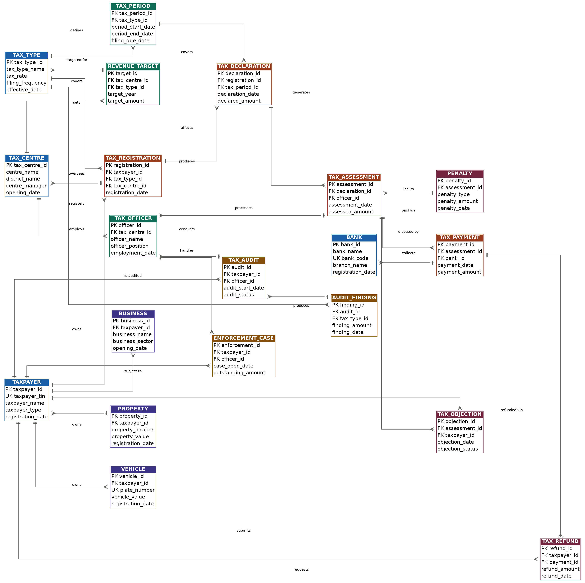


## Project Output

Screenshots of the database tables and SQL query results are shown below.
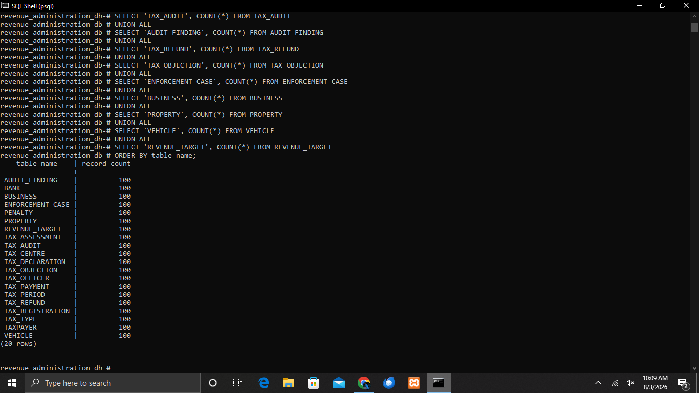
### Database Tables
all data in tables
```sql
SELECT 'TAXPAYER' AS table_name, COUNT(*) AS record_count FROM TAXPAYER
UNION ALL
SELECT 'TAX_CENTRE', COUNT(*) FROM TAX_CENTRE
UNION ALL
SELECT 'TAX_TYPE', COUNT(*) FROM TAX_TYPE
UNION ALL
SELECT 'TAX_OFFICER', COUNT(*) FROM TAX_OFFICER
UNION ALL
SELECT 'TAX_REGISTRATION', COUNT(*) FROM TAX_REGISTRATION
UNION ALL
SELECT 'TAX_PERIOD', COUNT(*) FROM TAX_PERIOD
UNION ALL
SELECT 'TAX_DECLARATION', COUNT(*) FROM TAX_DECLARATION
UNION ALL
SELECT 'TAX_ASSESSMENT', COUNT(*) FROM TAX_ASSESSMENT
UNION ALL
SELECT 'TAX_PAYMENT', COUNT(*) FROM TAX_PAYMENT
UNION ALL
SELECT 'BANK', COUNT(*) FROM BANK
UNION ALL
SELECT 'PENALTY', COUNT(*) FROM PENALTY
UNION ALL
SELECT 'TAX_AUDIT', COUNT(*) FROM TAX_AUDIT
UNION ALL
SELECT 'AUDIT_FINDING', COUNT(*) FROM AUDIT_FINDING
UNION ALL
SELECT 'TAX_REFUND', COUNT(*) FROM TAX_REFUND
UNION ALL
SELECT 'TAX_OBJECTION', COUNT(*) FROM TAX_OBJECTION
UNION ALL
SELECT 'ENFORCEMENT_CASE', COUNT(*) FROM ENFORCEMENT_CASE
UNION ALL
SELECT 'BUSINESS', COUNT(*) FROM BUSINESS
UNION ALL
SELECT 'PROPERTY', COUNT(*) FROM PROPERTY
UNION ALL
SELECT 'VEHICLE', COUNT(*) FROM VEHICLE
UNION ALL
SELECT 'REVENUE_TARGET', COUNT(*) FROM REVENUE_TARGET
ORDER BY table_name;
```
### SQL Query Results
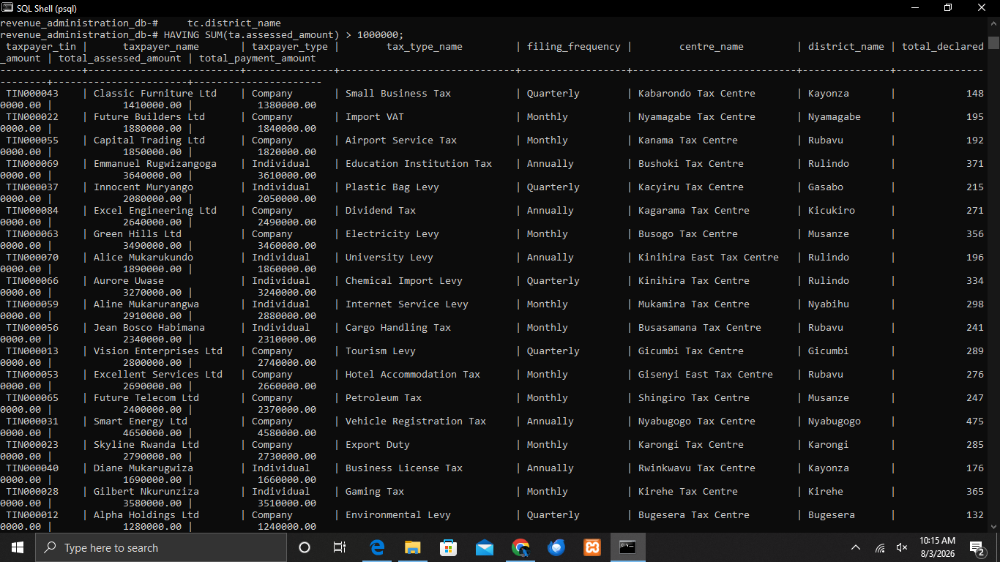
### querry 1
```sql
SELECT
    tp.taxpayer_tin,
    tp.taxpayer_name,
    tp.taxpayer_type,
    tt.tax_type_name,
    tt.filing_frequency,
    tc.centre_name,
    tc.district_name,
    SUM(td.declared_amount) AS total_declared,
    SUM(ta.assessed_amount) AS total_assessed,
    SUM(COALESCE(pay.payment_amount,0)) AS total_payment
FROM TAXPAYER tp
INNER JOIN TAX_REGISTRATION tr
ON tp.taxpayer_id = tr.taxpayer_id
INNER JOIN TAX_TYPE tt
ON tr.tax_type_id = tt.tax_type_id
INNER JOIN TAX_CENTRE tc
ON tr.tax_centre_id = tc.tax_centre_id
INNER JOIN TAX_DECLARATION td
ON tr.registration_id = td.registration_id
INNER JOIN TAX_ASSESSMENT ta
ON td.declaration_id = ta.declaration_id
LEFT JOIN TAX_PAYMENT pay
ON ta.assessment_id = pay.assessment_id
GROUP BY
tp.taxpayer_tin,
tp.taxpayer_name,
tp.taxpayer_type,
tt.tax_type_name,
tt.filing_frequency,
tc.centre_name,
tc.district_name
HAVING SUM(ta.assessed_amount) > 1000000;
```
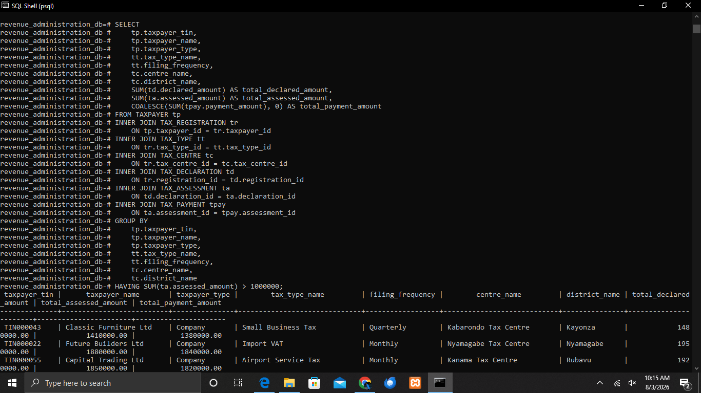
### querry1b
```sql
SELECT
    tp.taxpayer_tin,
    tp.taxpayer_name,
    tp.taxpayer_type,
    tt.tax_type_name,
    tt.filing_frequency,
    tc.centre_name,
    tc.district_name,
    SUM(td.declared_amount) AS total_declared,
    SUM(ta.assessed_amount) AS total_assessed,
    SUM(COALESCE(pay.payment_amount,0)) AS total_payment
FROM TAXPAYER tp
INNER JOIN TAX_REGISTRATION tr
ON tp.taxpayer_id = tr.taxpayer_id
INNER JOIN TAX_TYPE tt
ON tr.tax_type_id = tt.tax_type_id
INNER JOIN TAX_CENTRE tc
ON tr.tax_centre_id = tc.tax_centre_id
INNER JOIN TAX_DECLARATION td
ON tr.registration_id = td.registration_id
INNER JOIN TAX_ASSESSMENT ta
ON td.declaration_id = ta.declaration_id
LEFT JOIN TAX_PAYMENT pay
ON ta.assessment_id = pay.assessment_id
GROUP BY
tp.taxpayer_tin,
tp.taxpayer_name,
tp.taxpayer_type,
tt.tax_type_name,
tt.filing_frequency,
tc.centre_name,
tc.district_name
HAVING SUM(ta.assessed_amount) > 1000000;
```
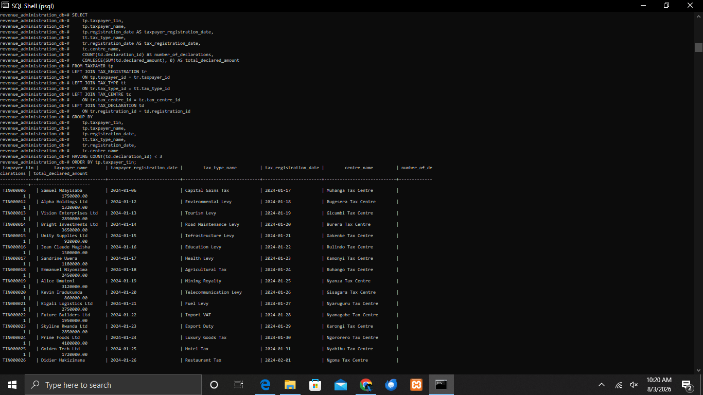
### queerry2
```sql
SELECT
tp.taxpayer_tin,
tp.taxpayer_name,
tp.registration_date,
tt.tax_type_name,
tr.registration_date,
tc.centre_name,
COUNT(td.declaration_id) AS number_of_declarations,
COALESCE(SUM(td.declared_amount),0) AS total_declared
FROM TAXPAYER tp
LEFT JOIN TAX_REGISTRATION tr
ON tp.taxpayer_id=tr.taxpayer_id
LEFT JOIN TAX_TYPE tt
ON tr.tax_type_id=tt.tax_type_id
LEFT JOIN TAX_CENTRE tc
ON tr.tax_centre_id=tc.tax_centre_id
LEFT JOIN TAX_DECLARATION td
ON tr.registration_id=td.registration_id
GROUP BY
tp.taxpayer_tin,
tp.taxpayer_name,
tp.registration_date,
tt.tax_type_name,
tr.registration_date,
tc.centre_name
HAVING COUNT(td.declaration_id)<3;
```
### querry 2b
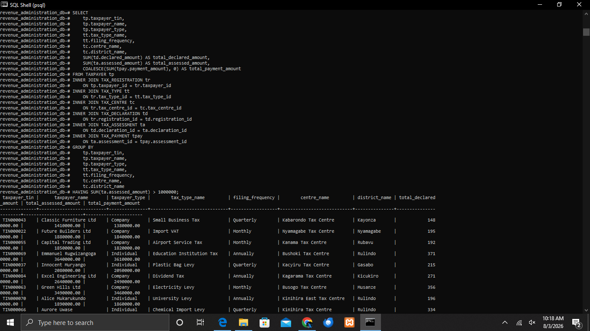
```sql
SELECT
tp.taxpayer_tin,
tp.taxpayer_name,
tp.registration_date,
tt.tax_type_name,
tr.registration_date,
tc.centre_name,
COUNT(td.declaration_id) AS number_of_declarations,
COALESCE(SUM(td.declared_amount),0) AS total_declared
FROM TAXPAYER tp
LEFT JOIN TAX_REGISTRATION tr
ON tp.taxpayer_id=tr.taxpayer_id
LEFT JOIN TAX_TYPE tt
ON tr.tax_type_id=tt.tax_type_id
LEFT JOIN TAX_CENTRE tc
ON tr.tax_centre_id=tc.tax_centre_id
LEFT JOIN TAX_DECLARATION td
ON tr.registration_id=td.registration_id
GROUP BY
tp.taxpayer_tin,
tp.taxpayer_name,
tp.registration_date,
tt.tax_type_name,
tr.registration_date,
tc.centre_name
HAVING COUNT(td.declaration_id)<3;
```
### querry 3
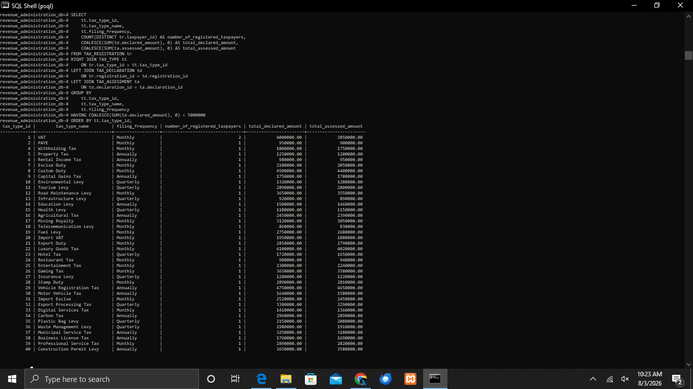
```sql
SELECT
tt.tax_type_id,
tt.tax_type_name,
tt.filing_frequency,
COUNT(tr.registration_id) AS registered_taxpayers,
COALESCE(SUM(td.declared_amount),0) AS total_declared,
COALESCE(SUM(ta.assessed_amount),0) AS total_assessed
FROM TAX_REGISTRATION tr
RIGHT JOIN TAX_TYPE tt
ON tr.tax_type_id=tt.tax_type_id
LEFT JOIN TAX_DECLARATION td
ON tr.registration_id=td.registration_id
LEFT JOIN TAX_ASSESSMENT ta
ON td.declaration_id=ta.declaration_id
GROUP BY
tt.tax_type_id,
tt.tax_type_name,
tt.filing_frequency
HAVING COALESCE(SUM(td.declared_amount),0)<5000000;
```
### querry 4
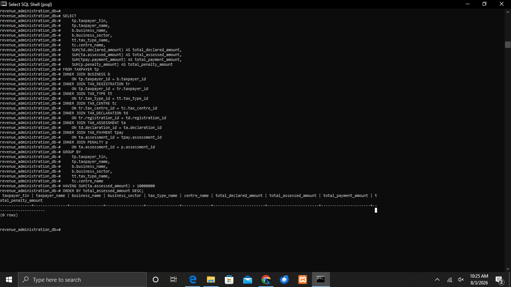
```sql
SELECT
tp.taxpayer_tin,
tp.taxpayer_name,
b.business_name,
b.business_sector,
tt.tax_type_name,
tc.centre_name,
SUM(td.declared_amount) total_declared,
SUM(ta.assessed_amount) total_assessed,
SUM(pay.payment_amount) total_payment,
SUM(p.penalty_amount) total_penalty
FROM TAXPAYER tp
INNER JOIN BUSINESS b
ON tp.taxpayer_id=b.taxpayer_id
INNER JOIN TAX_REGISTRATION tr
ON tp.taxpayer_id=tr.taxpayer_id
INNER JOIN TAX_TYPE tt
ON tr.tax_type_id=tt.tax_type_id
INNER JOIN TAX_CENTRE tc
ON tr.tax_centre_id=tc.tax_centre_id
INNER JOIN TAX_DECLARATION td
ON tr.registration_id=td.registration_id
INNER JOIN TAX_ASSESSMENT ta
ON td.declaration_id=ta.declaration_id
LEFT JOIN TAX_PAYMENT pay
ON ta.assessment_id=pay.assessment_id
LEFT JOIN PENALTY p
ON ta.assessment_id=p.assessment_id
GROUP BY
tp.taxpayer_tin,
tp.taxpayer_name,
b.business_name,
b.business_sector,
tt.tax_type_name,
tc.centre_name
HAVING SUM(ta.assessed_amount)>10000000;
```
### query 5
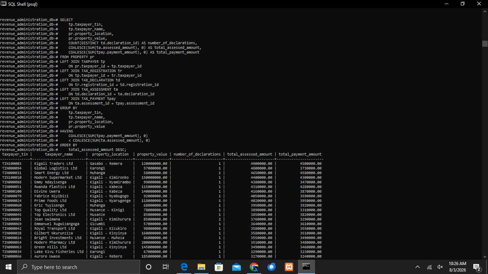
```sql
SELECT
tp.taxpayer_tin,
tp.taxpayer_name,
pr.property_location,
pr.property_value,
COUNT(td.declaration_id) number_of_declarations,
SUM(ta.assessed_amount) total_assessed,
COALESCE(SUM(pay.payment_amount),0) total_payment
FROM PROPERTY pr
LEFT JOIN TAXPAYER tp
ON pr.taxpayer_id=tp.taxpayer_id
LEFT JOIN TAX_REGISTRATION tr
ON tp.taxpayer_id=tr.taxpayer_id
LEFT JOIN TAX_DECLARATION td
ON tr.registration_id=td.registration_id
LEFT JOIN TAX_ASSESSMENT ta
ON td.declaration_id=ta.declaration_id
LEFT JOIN TAX_PAYMENT pay
ON ta.assessment_id=pay.assessment_id
GROUP BY
tp.taxpayer_tin,
tp.taxpayer_name,
pr.property_location,
pr.property_value
HAVING COALESCE(SUM(pay.payment_amount),0)<SUM(ta.assessed_amount);
```
### query 6
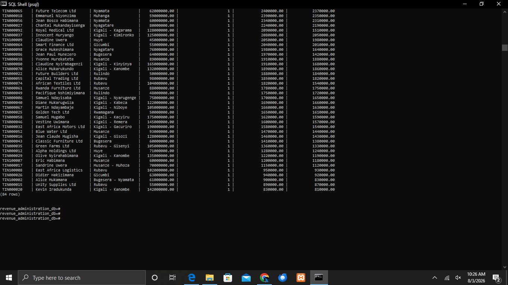
```sql
SELECT
    tp.taxpayer_tin,
    tp.taxpayer_name,
    v.plate_number,
    v.vehicle_value,
    tt.tax_type_name,
    COUNT(td.declaration_id) AS number_of_declarations,
    COALESCE(SUM(td.declared_amount),0) AS total_declared,
    COALESCE(SUM(ta.assessed_amount),0) AS total_assessed,
    COALESCE(SUM(p.penalty_amount),0) AS total_penalties
FROM TAXPAYER tp
RIGHT JOIN VEHICLE v
ON tp.taxpayer_id = v.taxpayer_id
LEFT JOIN TAX_REGISTRATION tr
ON tp.taxpayer_id = tr.taxpayer_id
LEFT JOIN TAX_TYPE tt
ON tr.tax_type_id = tt.tax_type_id
LEFT JOIN TAX_DECLARATION td
ON tr.registration_id = td.registration_id
LEFT JOIN TAX_ASSESSMENT ta
ON td.declaration_id = ta.declaration_id
LEFT JOIN PENALTY p
ON ta.assessment_id = p.assessment_id
GROUP BY
tp.taxpayer_tin,
tp.taxpayer_name,
v.plate_number,
v.vehicle_value,
tt.tax_type_name
HAVING v.vehicle_value > 10000000;
```
### query 7
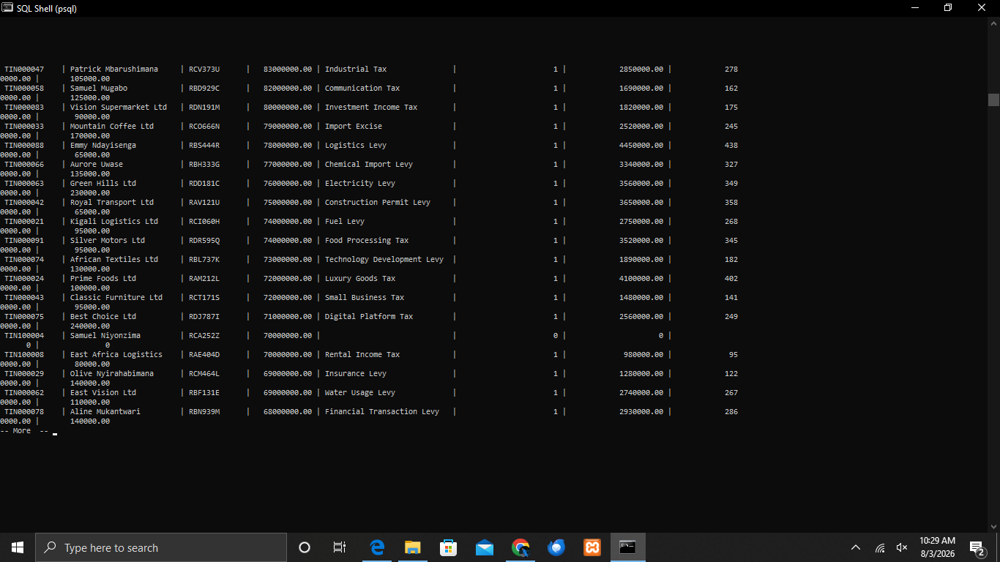
```sql
SELECT
    tp.taxpayer_tin,
    tp.taxpayer_name,
    tt.tax_type_name,
    per.period_start_date,
    per.period_end_date,
    per.filing_due_date,
    COUNT(td.declaration_id) AS declarations,
    SUM(td.declared_amount) AS total_declared,
    SUM(ta.assessed_amount) AS total_assessed,
    COALESCE(SUM(pay.payment_amount),0) AS total_paid,
    SUM(ta.assessed_amount)-COALESCE(SUM(pay.payment_amount),0)
        AS outstanding_balance
FROM TAXPAYER tp
INNER JOIN TAX_REGISTRATION tr
ON tp.taxpayer_id=tr.taxpayer_id
INNER JOIN TAX_TYPE tt
ON tr.tax_type_id=tt.tax_type_id
INNER JOIN TAX_DECLARATION td
ON tr.registration_id=td.registration_id
INNER JOIN TAX_PERIOD per
ON td.tax_period_id=per.tax_period_id
INNER JOIN TAX_ASSESSMENT ta
ON td.declaration_id=ta.declaration_id
LEFT JOIN TAX_PAYMENT pay
ON ta.assessment_id=pay.assessment_id
GROUP BY
tp.taxpayer_tin,
tp.taxpayer_name,
tt.tax_type_name,
per.period_start_date,
per.period_end_date,
per.filing_due_date
HAVING
SUM(ta.assessed_amount)-COALESCE(SUM(pay.payment_amount),0)>0;
```
### query 7b

```sql
SELECT
    tp.taxpayer_tin,
    tp.taxpayer_name,
    tt.tax_type_name,
    per.period_start_date,
    per.period_end_date,
    per.filing_due_date,
    COUNT(td.declaration_id) AS declarations,
    SUM(td.declared_amount) AS total_declared,
    SUM(ta.assessed_amount) AS total_assessed,
    COALESCE(SUM(pay.payment_amount),0) AS total_paid,
    SUM(ta.assessed_amount)-COALESCE(SUM(pay.payment_amount),0)
        AS outstanding_balance
FROM TAXPAYER tp
INNER JOIN TAX_REGISTRATION tr
ON tp.taxpayer_id=tr.taxpayer_id
INNER JOIN TAX_TYPE tt
ON tr.tax_type_id=tt.tax_type_id
INNER JOIN TAX_DECLARATION td
ON tr.registration_id=td.registration_id
INNER JOIN TAX_PERIOD per
ON td.tax_period_id=per.tax_period_id
INNER JOIN TAX_ASSESSMENT ta
ON td.declaration_id=ta.declaration_id
LEFT JOIN TAX_PAYMENT pay
ON ta.assessment_id=pay.assessment_id
GROUP BY
tp.taxpayer_tin,
tp.taxpayer_name,
tt.tax_type_name,
per.period_start_date,
per.period_end_date,
per.filing_due_date
HAVING
SUM(ta.assessed_amount)-COALESCE(SUM(pay.payment_amount),0)>0;
```
### query 7c
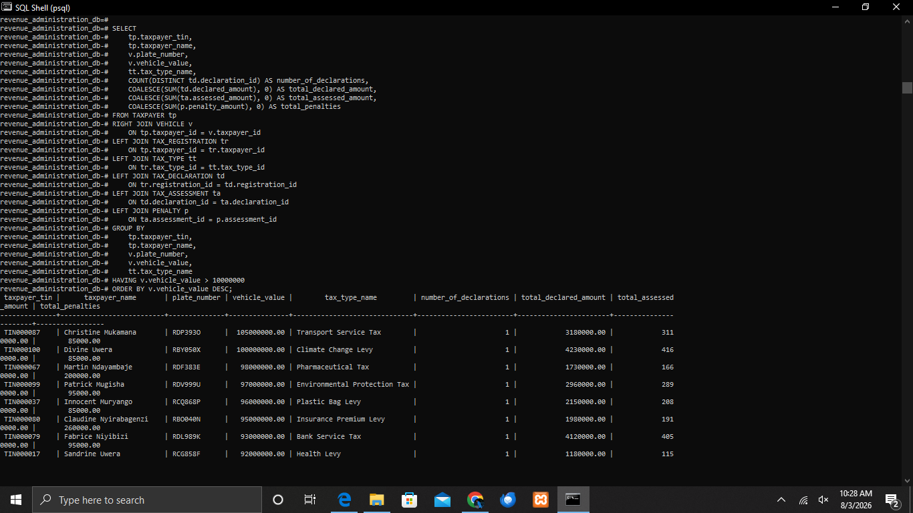
```sql
SELECT
    tp.taxpayer_tin,
    tp.taxpayer_name,
    tt.tax_type_name,
    per.period_start_date,
    per.period_end_date,
    per.filing_due_date,
    COUNT(td.declaration_id) AS declarations,
    SUM(td.declared_amount) AS total_declared,
    SUM(ta.assessed_amount) AS total_assessed,
    COALESCE(SUM(pay.payment_amount),0) AS total_paid,
    SUM(ta.assessed_amount)-COALESCE(SUM(pay.payment_amount),0)
        AS outstanding_balance
FROM TAXPAYER tp
INNER JOIN TAX_REGISTRATION tr
ON tp.taxpayer_id=tr.taxpayer_id
INNER JOIN TAX_TYPE tt
ON tr.tax_type_id=tt.tax_type_id
INNER JOIN TAX_DECLARATION td
ON tr.registration_id=td.registration_id
INNER JOIN TAX_PERIOD per
ON td.tax_period_id=per.tax_period_id
INNER JOIN TAX_ASSESSMENT ta
ON td.declaration_id=ta.declaration_id
LEFT JOIN TAX_PAYMENT pay
ON ta.assessment_id=pay.assessment_id
GROUP BY
tp.taxpayer_tin,
tp.taxpayer_name,
tt.tax_type_name,
per.period_start_date,
per.period_end_date,
per.filing_due_date
HAVING
SUM(ta.assessed_amount)-COALESCE(SUM(pay.payment_amount),0)>0;
```
### query 8
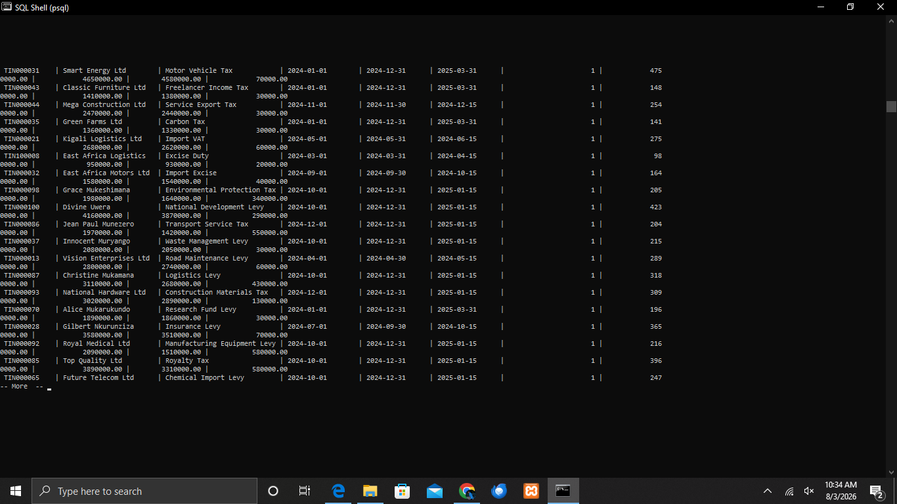
```sql
SELECT
    tp.taxpayer_tin,
    tp.taxpayer_name,
    a.audit_status,
    o.officer_name,
    c.centre_name,
    t.tax_type_name,
    COUNT(f.finding_id) AS findings,
    COALESCE(SUM(f.finding_amount),0) AS total_finding
FROM TAXPAYER tp
LEFT JOIN TAX_AUDIT a
ON tp.taxpayer_id=a.taxpayer_id
LEFT JOIN TAX_OFFICER o
ON a.officer_id=o.officer_id
LEFT JOIN TAX_CENTRE c
ON o.tax_centre_id=c.tax_centre_id
LEFT JOIN AUDIT_FINDING f
ON a.audit_id=f.audit_id
LEFT JOIN TAX_TYPE t
ON f.tax_type_id=t.tax_type_id
GROUP BY
tp.taxpayer_tin,
tp.taxpayer_name,
a.audit_status,
o.officer_name,
c.centre_name,
t.tax_type_name
HAVING COALESCE(SUM(f.finding_amount),0)>2000000;
```
### query 8b

```sql
SELECT
    tp.taxpayer_tin,
    tp.taxpayer_name,
    a.audit_status,
    o.officer_name,
    c.centre_name,
    t.tax_type_name,
    COUNT(f.finding_id) AS findings,
    COALESCE(SUM(f.finding_amount),0) AS total_finding
FROM TAXPAYER tp
LEFT JOIN TAX_AUDIT a
ON tp.taxpayer_id=a.taxpayer_id
LEFT JOIN TAX_OFFICER o
ON a.officer_id=o.officer_id
LEFT JOIN TAX_CENTRE c
ON o.tax_centre_id=c.tax_centre_id
LEFT JOIN AUDIT_FINDING f
ON a.audit_id=f.audit_id
LEFT JOIN TAX_TYPE t
ON f.tax_type_id=t.tax_type_id
GROUP BY
tp.taxpayer_tin,
tp.taxpayer_name,
a.audit_status,
o.officer_name,
c.centre_name,
t.tax_type_name
HAVING COALESCE(SUM(f.finding_amount),0)>2000000;
```
### query 8c
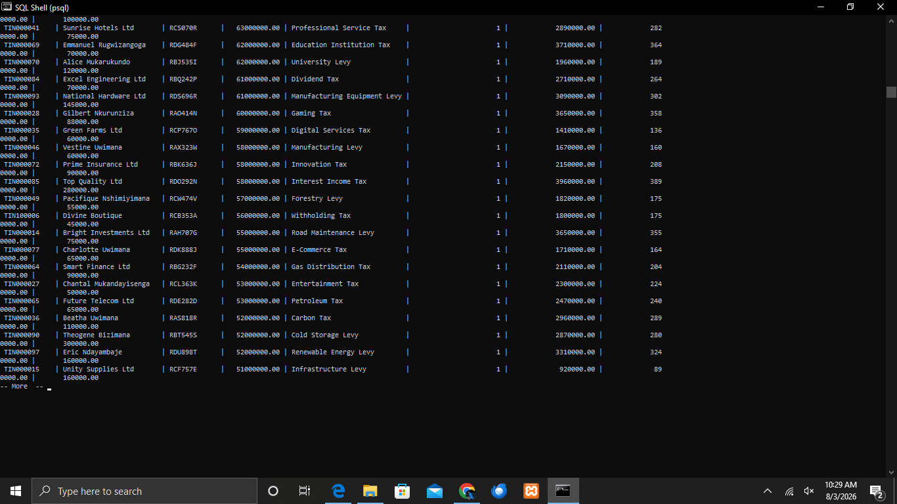
```sql
SELECT
    tp.taxpayer_tin,
    tp.taxpayer_name,
    a.audit_status,
    o.officer_name,
    c.centre_name,
    t.tax_type_name,
    COUNT(f.finding_id) AS findings,
    COALESCE(SUM(f.finding_amount),0) AS total_finding
FROM TAXPAYER tp
LEFT JOIN TAX_AUDIT a
ON tp.taxpayer_id=a.taxpayer_id
LEFT JOIN TAX_OFFICER o
ON a.officer_id=o.officer_id
LEFT JOIN TAX_CENTRE c
ON o.tax_centre_id=c.tax_centre_id
LEFT JOIN AUDIT_FINDING f
ON a.audit_id=f.audit_id
LEFT JOIN TAX_TYPE t
ON f.tax_type_id=t.tax_type_id
GROUP BY
tp.taxpayer_tin,
tp.taxpayer_name,
a.audit_status,
o.officer_name,
c.centre_name,
t.tax_type_name
HAVING COALESCE(SUM(f.finding_amount),0)>2000000;
```
### query 9
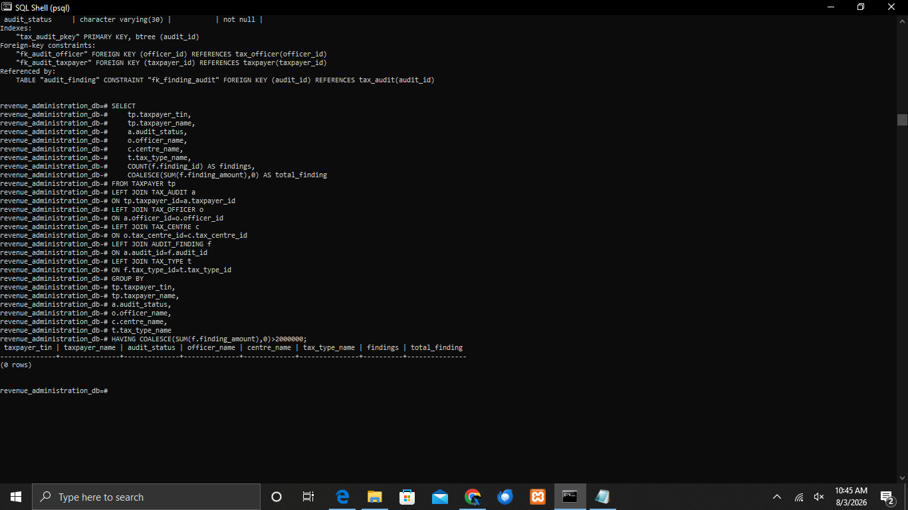
```sql
SELECT
    o.officer_id,
    o.officer_name,
    o.officer_position,
    c.centre_name,
    c.district_name,
    COUNT(a.audit_id) AS audits,
    COALESCE(SUM(f.finding_amount),0) AS total_finding,
    COALESCE(AVG(f.finding_amount),0) AS average_finding
FROM TAX_AUDIT a
RIGHT JOIN TAX_OFFICER o
ON a.officer_id=o.officer_id
LEFT JOIN TAX_CENTRE c
ON o.tax_centre_id=c.tax_centre_id
LEFT JOIN AUDIT_FINDING f
ON a.audit_id=f.audit_id
GROUP BY
o.officer_id,
o.officer_name,
o.officer_position,
c.centre_name,
c.district_name
HAVING COALESCE(AVG(f.finding_amount),0)>500000;
```
### query 10
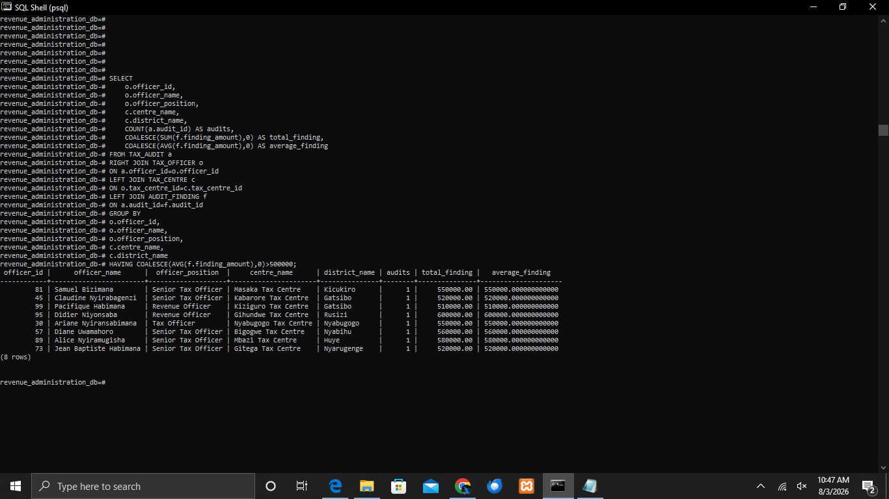
```sql
SELECT
    tp.taxpayer_tin,
    tp.taxpayer_name,
    a.assessment_id,
    a.assessment_date,
    a.assessed_amount,
    o.objection_status,
    COALESCE(SUM(pay.payment_amount),0) AS total_payment,
    COALESCE(SUM(p.penalty_amount),0) AS total_penalty
FROM TAX_ASSESSMENT a
INNER JOIN TAX_DECLARATION d
ON a.declaration_id=d.declaration_id
INNER JOIN TAX_REGISTRATION r
ON d.registration_id=r.registration_id
INNER JOIN TAXPAYER tp
ON r.taxpayer_id=tp.taxpayer_id
INNER JOIN TAX_OBJECTION o
ON a.assessment_id=o.assessment_id
LEFT JOIN TAX_PAYMENT pay
ON a.assessment_id=pay.assessment_id
LEFT JOIN PENALTY p
ON a.assessment_id=p.assessment_idSELECT
    tp.taxpayer_tin,
    tp.taxpayer_name,
    ta.assessment_id,
    ta.assessed_amount,
    COUNT(ob.objection_id) AS number_of_objections,
    COALESCE(SUM(pay.payment_amount),0) AS total_payment,
    (ta.assessed_amount - COALESCE(SUM(pay.payment_amount),0)) AS outstanding_balance
FROM TAX_ASSESSMENT ta
INNER JOIN TAX_DECLARATION td
ON ta.declaration_id = td.declaration_id
INNER JOIN TAX_REGISTRATION tr
ON td.registration_id = tr.registration_id
INNER JOIN TAXPAYER tp
ON tr.taxpayer_id = tp.taxpayer_id
LEFT JOIN TAX_OBJECTION ob
ON ta.assessment_id = ob.assessment_id
LEFT JOIN TAX_PAYMENT pay
ON ta.assessment_id = pay.assessment_id
GROUP BY
tp.taxpayer_tin,
tp.taxpayer_name,
ta.assessment_id,
ta.assessed_amount
HAVING
(ta.assessed_amount - COALESCE(SUM(pay.payment_amount),0)) > 500000;
GROUP BY
tp.taxpayer_tin,
tp.taxpayer_name,
a.assessment_id,
a.assessment_date,
a.assessed_amount,
o.objection_status
HAVING COALESCE(SUM(p.penalty_amount),0)>100000;
```
### query 11
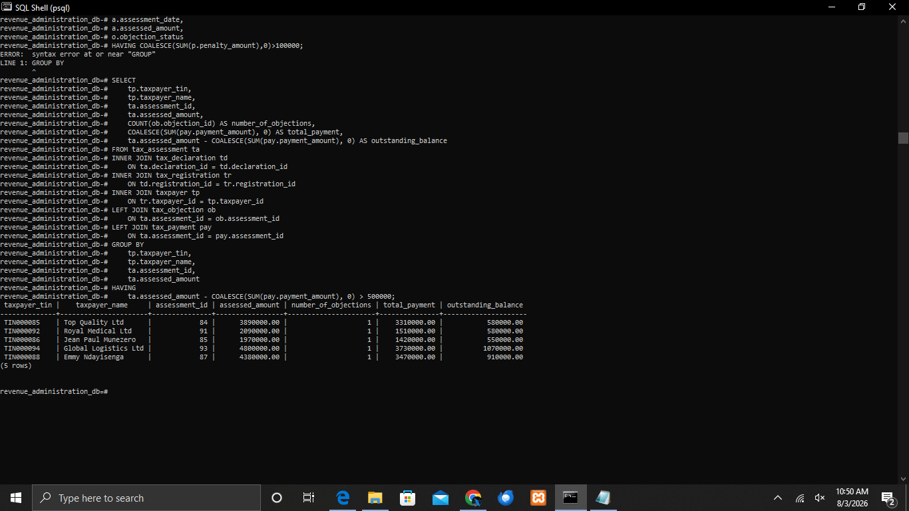
```sql
SELECT
    tp.taxpayer_tin,
    tp.taxpayer_name,
    ta.assessment_id,
    ta.assessed_amount,
    COUNT(ob.objection_id) AS number_of_objections,
    COALESCE(SUM(pay.payment_amount),0) AS total_payment,
    (ta.assessed_amount - COALESCE(SUM(pay.payment_amount),0)) AS outstanding_balance
FROM TAX_ASSESSMENT ta
INNER JOIN TAX_DECLARATION td
ON ta.declaration_id = td.declaration_id
INNER JOIN TAX_REGISTRATION tr
ON td.registration_id = tr.registration_id
INNER JOIN TAXPAYER tp
ON tr.taxpayer_id = tp.taxpayer_id
LEFT JOIN TAX_OBJECTION ob
ON ta.assessment_id = ob.assessment_id
LEFT JOIN TAX_PAYMENT pay
ON ta.assessment_id = pay.assessment_id
GROUP BY
tp.taxpayer_tin,
tp.taxpayer_name,
ta.assessment_id,
ta.assessed_amount
HAVING
(ta.assessed_amount - COALESCE(SUM(pay.payment_amount),0)) > 500000;
```
### query 12
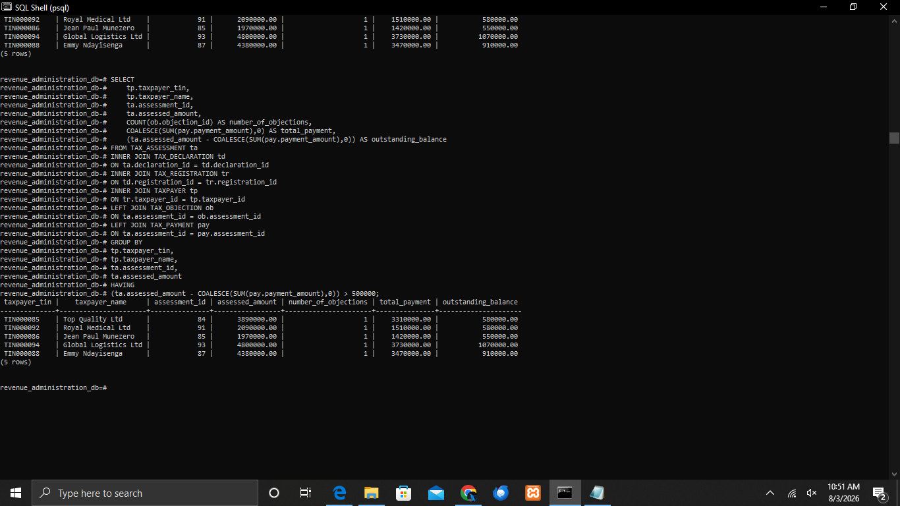
```sql
SELECT
    b.bank_id,
    b.bank_name,
    b.bank_code,
    b.branch_name,
    COUNT(tp.payment_id) AS number_of_payments,
    COALESCE(SUM(tp.payment_amount),0) AS total_payment,
    COALESCE(AVG(tp.payment_amount),0) AS average_payment,
    COALESCE(MAX(tp.payment_amount),0) AS maximum_payment,
    COALESCE(MIN(tp.payment_amount),0) AS minimum_payment
FROM TAX_PAYMENT tp
RIGHT JOIN BANK b
ON tp.bank_id = b.bank_id
GROUP BY
b.bank_id,
b.bank_name,
b.bank_code,
b.branch_name
HAVING
COALESCE(SUM(tp.payment_amount),0) < 20000000;
```
### query 13
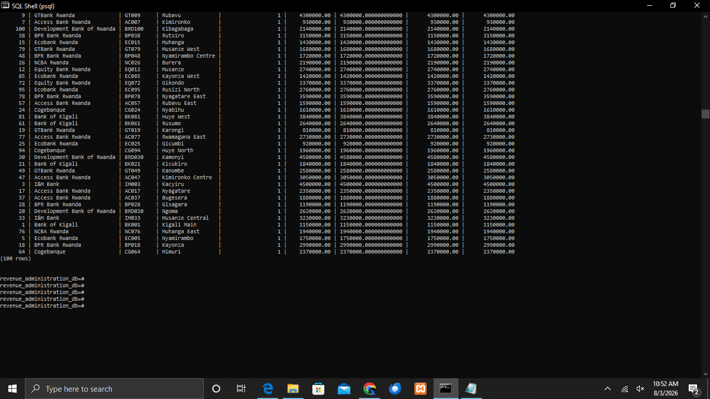
```sql
SELECT
    t.taxpayer_tin,
    t.taxpayer_name,
    p.payment_date,
    b.bank_name,
    tt.tax_type_name,
    COUNT(p.payment_id) AS number_of_payments,
    SUM(p.payment_amount) AS total_payment,
    COALESCE(SUM(r.refund_amount),0) AS total_refund,
    (SUM(p.payment_amount)-COALESCE(SUM(r.refund_amount),0))
        AS net_revenue
FROM TAXPAYER t
INNER JOIN TAX_REGISTRATION tr
ON t.taxpayer_id=tr.taxpayer_id
INNER JOIN TAX_TYPE tt
ON tr.tax_type_id=tt.tax_type_id
INNER JOIN TAX_DECLARATION d
ON tr.registration_id=d.registration_id
INNER JOIN TAX_ASSESSMENT a
ON d.declaration_id=a.declaration_id
INNER JOIN TAX_PAYMENT p
ON a.assessment_id=p.assessment_id
INNER JOIN BANK b
ON p.bank_id=b.bank_id
LEFT JOIN TAX_REFUND r
ON p.payment_id=r.payment_id
GROUP BY
t.taxpayer_tin,
t.taxpayer_name,
p.payment_date,
b.bank_name,
tt.tax_type_name
HAVING
(SUM(p.payment_amount)-COALESCE(SUM(r.refund_amount),0))
>1000000;
```
### query 13b
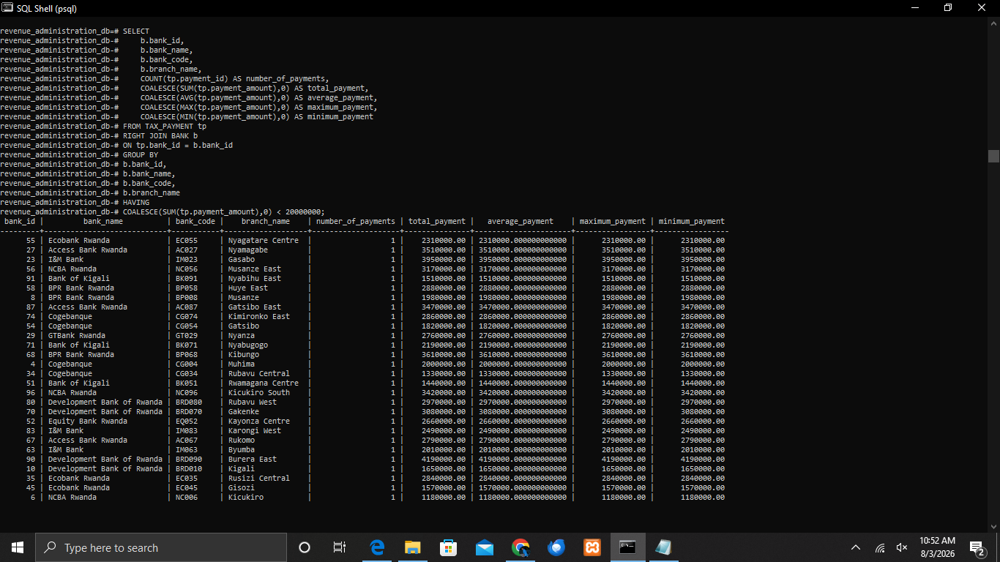
```sql
SELECT
    t.taxpayer_tin,
    t.taxpayer_name,
    p.payment_date,
    b.bank_name,
    tt.tax_type_name,
    COUNT(p.payment_id) AS number_of_payments,
    SUM(p.payment_amount) AS total_payment,
    COALESCE(SUM(r.refund_amount),0) AS total_refund,
    (SUM(p.payment_amount)-COALESCE(SUM(r.refund_amount),0))
        AS net_revenue
FROM TAXPAYER t
INNER JOIN TAX_REGISTRATION tr
ON t.taxpayer_id=tr.taxpayer_id
INNER JOIN TAX_TYPE tt
ON tr.tax_type_id=tt.tax_type_id
INNER JOIN TAX_DECLARATION d
ON tr.registration_id=d.registration_id
INNER JOIN TAX_ASSESSMENT a
ON d.declaration_id=a.declaration_id
INNER JOIN TAX_PAYMENT p
ON a.assessment_id=p.assessment_id
INNER JOIN BANK b
ON p.bank_id=b.bank_id
LEFT JOIN TAX_REFUND r
ON p.payment_id=r.payment_id
GROUP BY
t.taxpayer_tin,
t.taxpayer_name,
p.payment_date,
b.bank_name,
tt.tax_type_name
HAVING
(SUM(p.payment_amount)-COALESCE(SUM(r.refund_amount),0))
>1000000;
```
### query 14
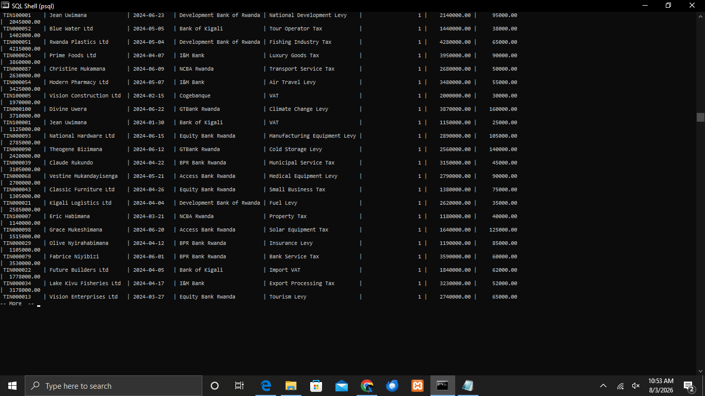
```sql
SELECT
    t.taxpayer_tin,
    t.taxpayer_name,
    p.payment_id,
    p.payment_amount,
    r.refund_amount,
    r.refund_date,
    ROUND(
        (COALESCE(r.refund_amount,0)/p.payment_amount)*100,
        2
    ) AS refund_percentage
FROM TAX_PAYMENT p
LEFT JOIN TAX_REFUND r
ON p.payment_id=r.payment_id
INNER JOIN TAX_ASSESSMENT a
ON p.assessment_id=a.assessment_id
INNER JOIN TAX_DECLARATION d
ON a.declaration_id=d.declaration_id
INNER JOIN TAX_REGISTRATION tr
ON d.registration_id=tr.registration_id
INNER JOIN TAXPAYER t
ON tr.taxpayer_id=t.taxpayer_id
GROUP BY
t.taxpayer_tin,
t.taxpayer_name,
p.payment_id,
p.payment_amount,
r.refund_amount,
r.refund_date
HAVING
ROUND((COALESCE(r.refund_amount,0)/p.payment_amount)*100,2)>10;
```
### query 14b
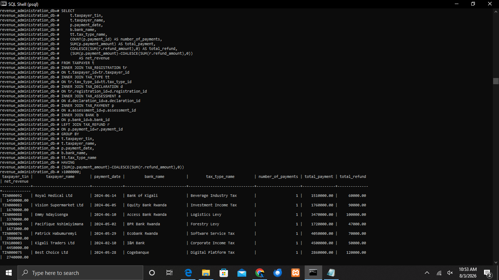
```sql
SELECT
    t.taxpayer_tin,
    t.taxpayer_name,
    p.payment_id,
    p.payment_amount,
    r.refund_amount,
    r.refund_date,
    ROUND(
        (COALESCE(r.refund_amount,0)/p.payment_amount)*100,
        2
    ) AS refund_percentage
FROM TAX_PAYMENT p
LEFT JOIN TAX_REFUND r
ON p.payment_id=r.payment_id
INNER JOIN TAX_ASSESSMENT a
ON p.assessment_id=a.assessment_id
INNER JOIN TAX_DECLARATION d
ON a.declaration_id=d.declaration_id
INNER JOIN TAX_REGISTRATION tr
ON d.registration_id=tr.registration_id
INNER JOIN TAXPAYER t
ON tr.taxpayer_id=t.taxpayer_id
GROUP BY
t.taxpayer_tin,
t.taxpayer_name,
p.payment_id,
p.payment_amount,
r.refund_amount,
r.refund_date
HAVING
ROUND((COALESCE(r.refund_amount,0)/p.payment_amount)*100,2)>10;
```
### query 15
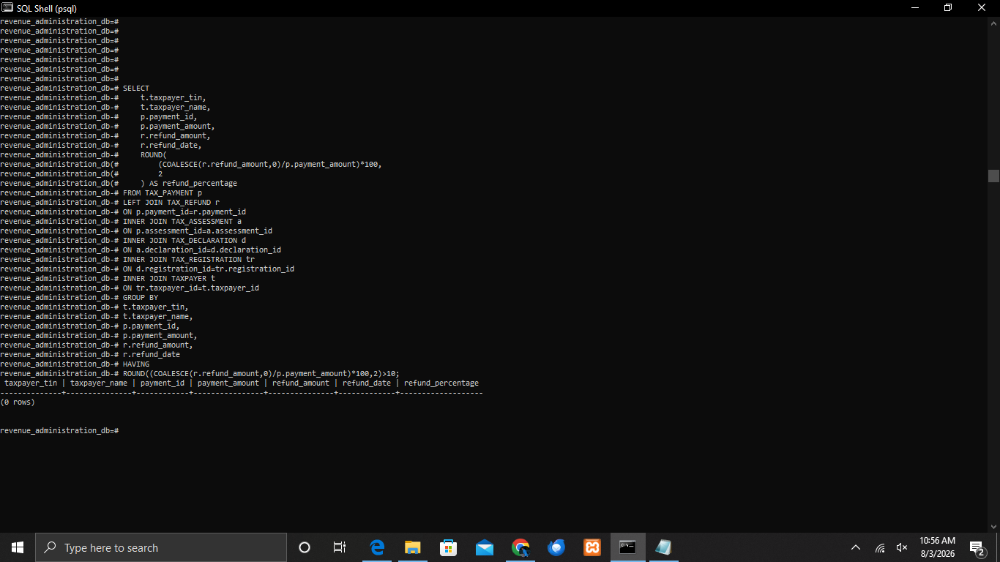
```sql
SELECT
    tc.tax_centre_id,
    tc.centre_name,
    tc.district_name,
    tc.centre_manager,
    tt.tax_type_name,
    rt.target_year,
    rt.target_amount,
    COALESCE(SUM(td.declared_amount),0) AS total_declared,
    COALESCE(SUM(ta.assessed_amount),0) AS total_assessed,
    COALESCE(SUM(tp.payment_amount),0) AS total_revenue
FROM TAX_REGISTRATION tr
RIGHT JOIN REVENUE_TARGET rt
ON tr.tax_centre_id=rt.tax_centre_id
INNER JOIN TAX_CENTRE tc
ON rt.tax_centre_id=tc.tax_centre_id
INNER JOIN TAX_TYPE tt
ON rt.tax_type_id=tt.tax_type_id
LEFT JOIN TAX_DECLARATION td
ON tr.registration_id=td.registration_id
LEFT JOIN TAX_ASSESSMENT ta
ON td.declaration_id=ta.declaration_id
LEFT JOIN TAX_PAYMENT tp
ON ta.assessment_id=tp.assessment_id
GROUP BY
tc.tax_centre_id,
tc.centre_name,
tc.district_name,
tc.centre_manager,
tt.tax_type_name,
rt.target_year,
rt.target_amount
HAVING
COALESCE(SUM(tp.payment_amount),0) < rt.target_amount;
```
### query 16
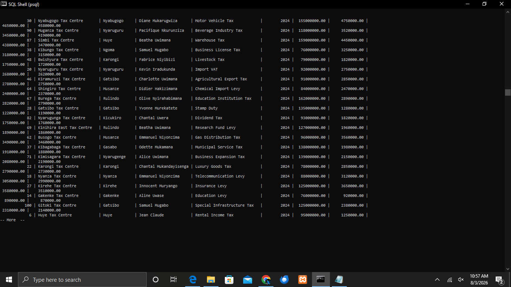
```sql
SELECT
    o.officer_id,
    o.officer_name,
    o.officer_position,
    tc.centre_name,
    COUNT(DISTINCT ta.assessment_id) AS number_of_assessments,
    SUM(ta.assessed_amount) AS total_assessed_amount,
    COUNT(DISTINCT au.audit_id) AS number_of_audits,
    COALESCE(SUM(af.finding_amount),0) AS total_audit_finding_amount,
    COUNT(DISTINCT ec.enforcement_id) AS number_of_enforcement_cases,
    COALESCE(SUM(ec.outstanding_amount),0) AS total_enforcement_outstanding
FROM TAX_OFFICER o
INNER JOIN TAX_CENTRE tc
ON o.tax_centre_id = tc.tax_centre_id
LEFT JOIN TAX_ASSESSMENT ta
ON o.officer_id = ta.officer_id
LEFT JOIN TAX_AUDIT au
ON o.officer_id = au.officer_id
LEFT JOIN AUDIT_FINDING af
ON au.audit_id = af.audit_id
LEFT JOIN ENFORCEMENT_CASE ec
ON o.officer_id = ec.officer_id
GROUP BY
o.officer_id,
o.officer_name,
o.officer_position,
tc.centre_name
HAVING
COUNT(DISTINCT ta.assessment_id) > 5
AND COALESCE(SUM(ec.outstanding_amount),0) > 1000000;
```
### query 16b
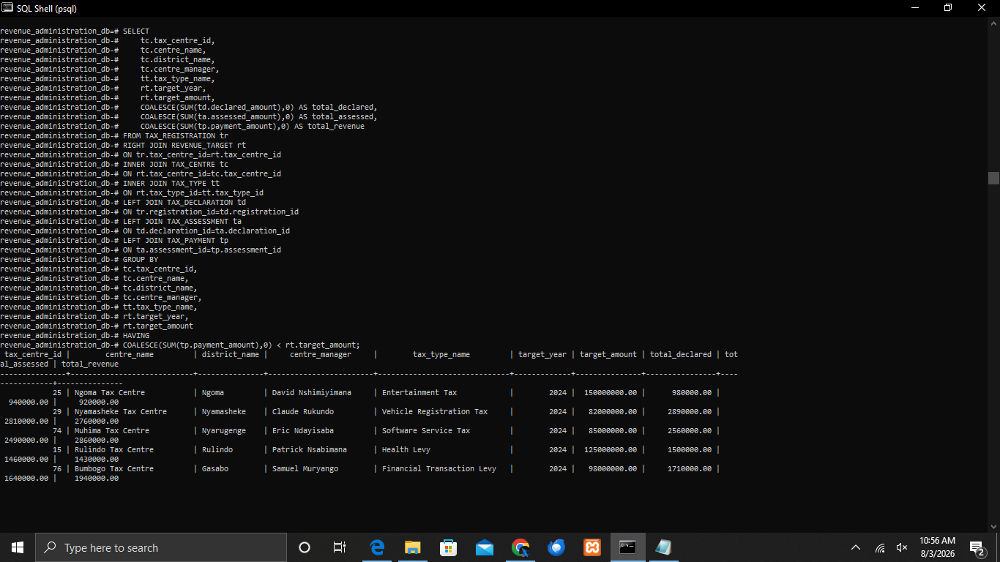
```sql
SELECT
    o.officer_id,
    o.officer_name,
    o.officer_position,
    tc.centre_name,
    COUNT(DISTINCT ta.assessment_id) AS number_of_assessments,
    SUM(ta.assessed_amount) AS total_assessed_amount,
    COUNT(DISTINCT au.audit_id) AS number_of_audits,
    COALESCE(SUM(af.finding_amount),0) AS total_audit_finding_amount,
    COUNT(DISTINCT ec.enforcement_id) AS number_of_enforcement_cases,
    COALESCE(SUM(ec.outstanding_amount),0) AS total_enforcement_outstanding
FROM TAX_OFFICER o
INNER JOIN TAX_CENTRE tc
ON o.tax_centre_id = tc.tax_centre_id
LEFT JOIN TAX_ASSESSMENT ta
ON o.officer_id = ta.officer_id
LEFT JOIN TAX_AUDIT au
ON o.officer_id = au.officer_id
LEFT JOIN AUDIT_FINDING af
ON au.audit_id = af.audit_id
LEFT JOIN ENFORCEMENT_CASE ec
ON o.officer_id = ec.officer_id
GROUP BY
o.officer_id,
o.officer_name,
o.officer_position,
tc.centre_name
HAVING
COUNT(DISTINCT ta.assessment_id) > 5
AND COALESCE(SUM(ec.outstanding_amount),0) > 1000000;
```
### query 17
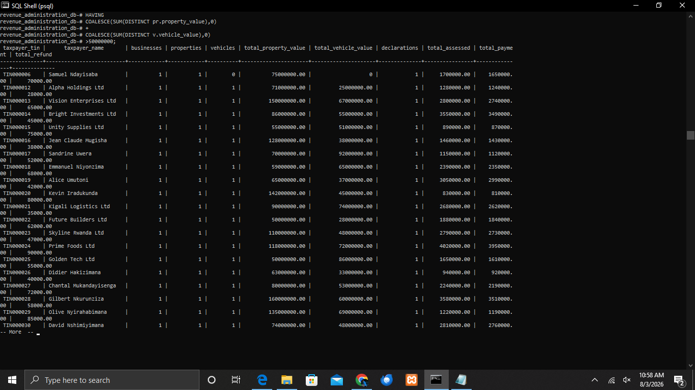
```sql
SELECT
    tp.taxpayer_tin,
    tp.taxpayer_name,
    COUNT(DISTINCT b.business_id) AS businesses,
    COUNT(DISTINCT pr.property_id) AS properties,
    COUNT(DISTINCT v.vehicle_id) AS vehicles,
    COALESCE(SUM(DISTINCT pr.property_value),0) AS total_property_value,
    COALESCE(SUM(DISTINCT v.vehicle_value),0) AS total_vehicle_value,
    COUNT(DISTINCT td.declaration_id) AS declarations,
    COALESCE(SUM(ta.assessed_amount),0) AS total_assessed,
    COALESCE(SUM(pay.payment_amount),0) AS total_payment,
    COALESCE(SUM(r.refund_amount),0) AS total_refund
FROM TAXPAYER tp
LEFT JOIN BUSINESS b
ON tp.taxpayer_id=b.taxpayer_id
LEFT JOIN PROPERTY pr
ON tp.taxpayer_id=pr.taxpayer_id
LEFT JOIN VEHICLE v
ON tp.taxpayer_id=v.taxpayer_id
LEFT JOIN TAX_REGISTRATION tr
ON tp.taxpayer_id=tr.taxpayer_id
LEFT JOIN TAX_DECLARATION td
ON tr.registration_id=td.registration_id
LEFT JOIN TAX_ASSESSMENT ta
ON td.declaration_id=ta.declaration_id
LEFT JOIN TAX_PAYMENT pay
ON ta.assessment_id=pay.assessment_id
LEFT JOIN TAX_REFUND r
ON pay.payment_id=r.payment_id
GROUP BY
tp.taxpayer_tin,
tp.taxpayer_name
HAVING
COALESCE(SUM(DISTINCT pr.property_value),0)
+
COALESCE(SUM(DISTINCT v.vehicle_value),0)
>50000000;
```
### query 17b
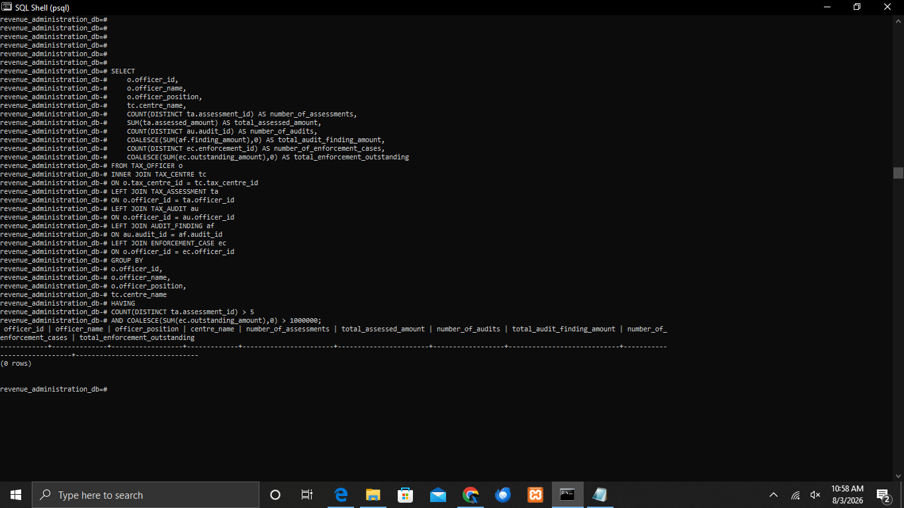
```sql
SELECT
    tp.taxpayer_tin,
    tp.taxpayer_name,
    COUNT(DISTINCT b.business_id) AS businesses,
    COUNT(DISTINCT pr.property_id) AS properties,
    COUNT(DISTINCT v.vehicle_id) AS vehicles,
    COALESCE(SUM(DISTINCT pr.property_value),0) AS total_property_value,
    COALESCE(SUM(DISTINCT v.vehicle_value),0) AS total_vehicle_value,
    COUNT(DISTINCT td.declaration_id) AS declarations,
    COALESCE(SUM(ta.assessed_amount),0) AS total_assessed,
    COALESCE(SUM(pay.payment_amount),0) AS total_payment,
    COALESCE(SUM(r.refund_amount),0) AS total_refund
FROM TAXPAYER tp
LEFT JOIN BUSINESS b
ON tp.taxpayer_id=b.taxpayer_id
LEFT JOIN PROPERTY pr
ON tp.taxpayer_id=pr.taxpayer_id
LEFT JOIN VEHICLE v
ON tp.taxpayer_id=v.taxpayer_id
LEFT JOIN TAX_REGISTRATION tr
ON tp.taxpayer_id=tr.taxpayer_id
LEFT JOIN TAX_DECLARATION td
ON tr.registration_id=td.registration_id
LEFT JOIN TAX_ASSESSMENT ta
ON td.declaration_id=ta.declaration_id
LEFT JOIN TAX_PAYMENT pay
ON ta.assessment_id=pay.assessment_id
LEFT JOIN TAX_REFUND r
ON pay.payment_id=r.payment_id
GROUP BY
tp.taxpayer_tin,
tp.taxpayer_name
HAVING
COALESCE(SUM(DISTINCT pr.property_value),0)
+
COALESCE(SUM(DISTINCT v.vehicle_value),0)
>50000000;
```
### query 18
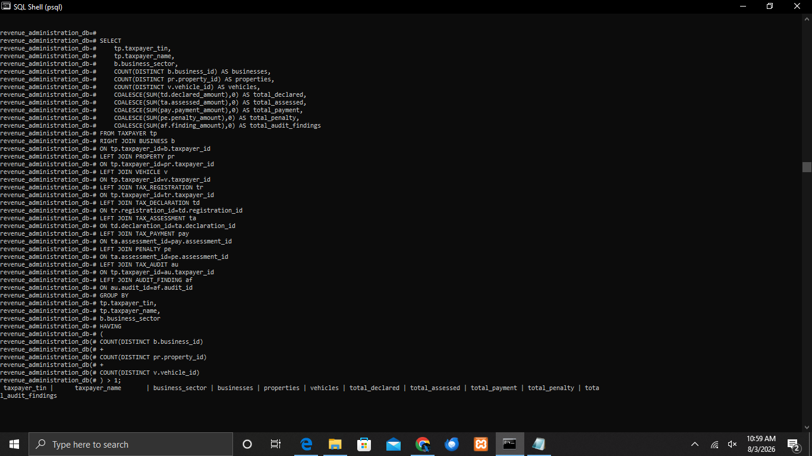
```sql
SELECT
    tp.taxpayer_tin,
    tp.taxpayer_name,
    b.business_sector,
    COUNT(DISTINCT b.business_id) AS businesses,
    COUNT(DISTINCT pr.property_id) AS properties,
    COUNT(DISTINCT v.vehicle_id) AS vehicles,
    COALESCE(SUM(td.declared_amount),0) AS total_declared,
    COALESCE(SUM(ta.assessed_amount),0) AS total_assessed,
    COALESCE(SUM(pay.payment_amount),0) AS total_payment,
    COALESCE(SUM(pe.penalty_amount),0) AS total_penalty,
    COALESCE(SUM(af.finding_amount),0) AS total_audit_findings
FROM TAXPAYER tp
RIGHT JOIN BUSINESS b
ON tp.taxpayer_id=b.taxpayer_id
LEFT JOIN PROPERTY pr
ON tp.taxpayer_id=pr.taxpayer_id
LEFT JOIN VEHICLE v
ON tp.taxpayer_id=v.taxpayer_id
LEFT JOIN TAX_REGISTRATION tr
ON tp.taxpayer_id=tr.taxpayer_id
LEFT JOIN TAX_DECLARATION td
ON tr.registration_id=td.registration_id
LEFT JOIN TAX_ASSESSMENT ta
ON td.declaration_id=ta.declaration_id
LEFT JOIN TAX_PAYMENT pay
ON ta.assessment_id=pay.assessment_id
LEFT JOIN PENALTY pe
ON ta.assessment_id=pe.assessment_id
LEFT JOIN TAX_AUDIT au
ON tp.taxpayer_id=au.taxpayer_id
LEFT JOIN AUDIT_FINDING af
ON au.audit_id=af.audit_id
GROUP BY
tp.taxpayer_tin,
tp.taxpayer_name,
b.business_sector
HAVING
(
COUNT(DISTINCT b.business_id)
+
COUNT(DISTINCT pr.property_id)
+
COUNT(DISTINCT v.vehicle_id)
) > 1;
```
### query 18b
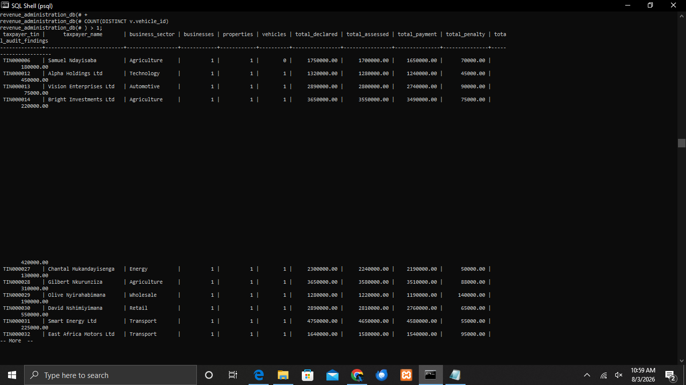
```sql
SELECT
    tp.taxpayer_tin,
    tp.taxpayer_name,
    b.business_sector,
    COUNT(DISTINCT b.business_id) AS businesses,
    COUNT(DISTINCT pr.property_id) AS properties,
    COUNT(DISTINCT v.vehicle_id) AS vehicles,
    COALESCE(SUM(td.declared_amount),0) AS total_declared,
    COALESCE(SUM(ta.assessed_amount),0) AS total_assessed,
    COALESCE(SUM(pay.payment_amount),0) AS total_payment,
    COALESCE(SUM(pe.penalty_amount),0) AS total_penalty,
    COALESCE(SUM(af.finding_amount),0) AS total_audit_findings
FROM TAXPAYER tp
RIGHT JOIN BUSINESS b
ON tp.taxpayer_id=b.taxpayer_id
LEFT JOIN PROPERTY pr
ON tp.taxpayer_id=pr.taxpayer_id
LEFT JOIN VEHICLE v
ON tp.taxpayer_id=v.taxpayer_id
LEFT JOIN TAX_REGISTRATION tr
ON tp.taxpayer_id=tr.taxpayer_id
LEFT JOIN TAX_DECLARATION td
ON tr.registration_id=td.registration_id
LEFT JOIN TAX_ASSESSMENT ta
ON td.declaration_id=ta.declaration_id
LEFT JOIN TAX_PAYMENT pay
ON ta.assessment_id=pay.assessment_id
LEFT JOIN PENALTY pe
ON ta.assessment_id=pe.assessment_id
LEFT JOIN TAX_AUDIT au
ON tp.taxpayer_id=au.taxpayer_id
LEFT JOIN AUDIT_FINDING af
ON au.audit_id=af.audit_id
GROUP BY
tp.taxpayer_tin,
tp.taxpayer_name,
b.business_sector
HAVING
(
COUNT(DISTINCT b.business_id)
+
COUNT(DISTINCT pr.property_id)
+
COUNT(DISTINCT v.vehicle_id)
) > 1;
```
### query 18b1
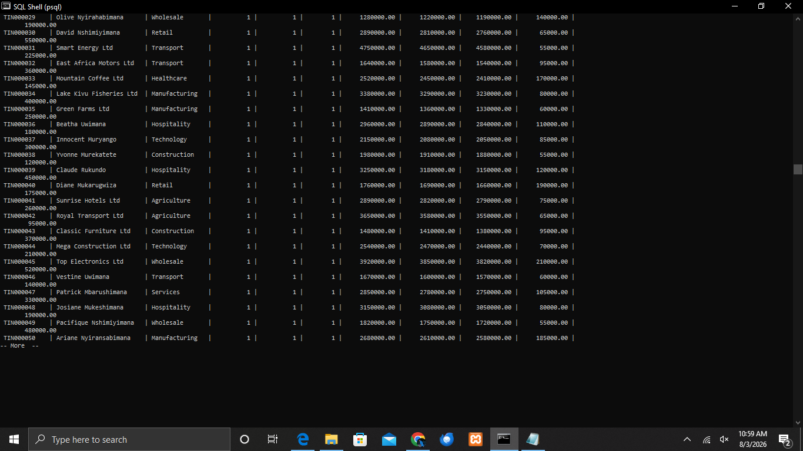
```sql
SELECT
    tp.taxpayer_tin,
    tp.taxpayer_name,
    b.business_sector,
    COUNT(DISTINCT b.business_id) AS businesses,
    COUNT(DISTINCT pr.property_id) AS properties,
    COUNT(DISTINCT v.vehicle_id) AS vehicles,
    COALESCE(SUM(td.declared_amount),0) AS total_declared,
    COALESCE(SUM(ta.assessed_amount),0) AS total_assessed,
    COALESCE(SUM(pay.payment_amount),0) AS total_payment,
    COALESCE(SUM(pe.penalty_amount),0) AS total_penalty,
    COALESCE(SUM(af.finding_amount),0) AS total_audit_findings
FROM TAXPAYER tp
RIGHT JOIN BUSINESS b
ON tp.taxpayer_id=b.taxpayer_id
LEFT JOIN PROPERTY pr
ON tp.taxpayer_id=pr.taxpayer_id
LEFT JOIN VEHICLE v
ON tp.taxpayer_id=v.taxpayer_id
LEFT JOIN TAX_REGISTRATION tr
ON tp.taxpayer_id=tr.taxpayer_id
LEFT JOIN TAX_DECLARATION td
ON tr.registration_id=td.registration_id
LEFT JOIN TAX_ASSESSMENT ta
ON td.declaration_id=ta.declaration_id
LEFT JOIN TAX_PAYMENT pay
ON ta.assessment_id=pay.assessment_id
LEFT JOIN PENALTY pe
ON ta.assessment_id=pe.assessment_id
LEFT JOIN TAX_AUDIT au
ON tp.taxpayer_id=au.taxpayer_id
LEFT JOIN AUDIT_FINDING af
ON au.audit_id=af.audit_id
GROUP BY
tp.taxpayer_tin,
tp.taxpayer_name,
b.business_sector
HAVING
(
COUNT(DISTINCT b.business_id)
+
COUNT(DISTINCT pr.property_id)
+
COUNT(DISTINCT v.vehicle_id)
) > 1;
```
### query 19
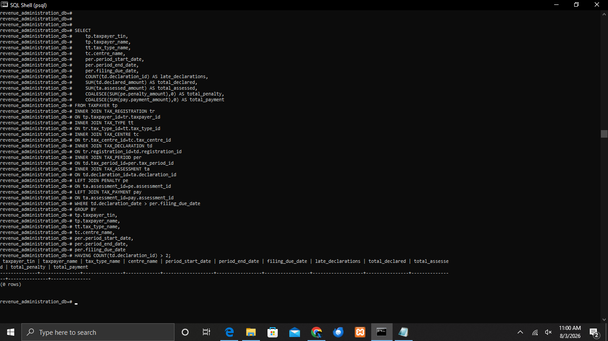
```sql
SELECT
    tp.taxpayer_tin,
    tp.taxpayer_name,
    tt.tax_type_name,
    tc.centre_name,
    per.period_start_date,
    per.period_end_date,
    per.filing_due_date,
    COUNT(td.declaration_id) AS late_declarations,
    SUM(td.declared_amount) AS total_declared,
    SUM(ta.assessed_amount) AS total_assessed,
    COALESCE(SUM(pe.penalty_amount),0) AS total_penalty,
    COALESCE(SUM(pay.payment_amount),0) AS total_payment
FROM TAXPAYER tp
INNER JOIN TAX_REGISTRATION tr
ON tp.taxpayer_id=tr.taxpayer_id
INNER JOIN TAX_TYPE tt
ON tr.tax_type_id=tt.tax_type_id
INNER JOIN TAX_CENTRE tc
ON tr.tax_centre_id=tc.tax_centre_id
INNER JOIN TAX_DECLARATION td
ON tr.registration_id=td.registration_id
INNER JOIN TAX_PERIOD per
ON td.tax_period_id=per.tax_period_id
INNER JOIN TAX_ASSESSMENT ta
ON td.declaration_id=ta.declaration_id
LEFT JOIN PENALTY pe
ON ta.assessment_id=pe.assessment_id
LEFT JOIN TAX_PAYMENT pay
ON ta.assessment_id=pay.assessment_id
WHERE td.declaration_date > per.filing_due_date
GROUP BY
tp.taxpayer_tin,
tp.taxpayer_name,
tt.tax_type_name,
tc.centre_name,
per.period_start_date,
per.period_end_date,
per.filing_due_date
HAVING COUNT(td.declaration_id) > 2;
```
### query 20
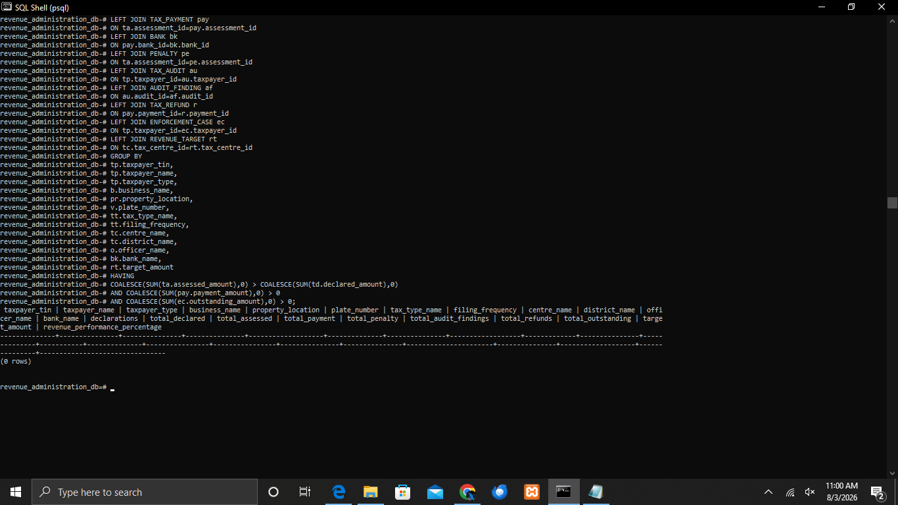
```sql
SELECT
    tp.taxpayer_tin,
    tp.taxpayer_name,
    tp.taxpayer_type,
    b.business_name,
    pr.property_location,
    v.plate_number,
    tt.tax_type_name,
    tt.filing_frequency,
    tc.centre_name,
    tc.district_name,
    o.officer_name,
    bk.bank_name,
    COUNT(DISTINCT td.declaration_id) AS declarations,
    COALESCE(SUM(td.declared_amount),0) AS total_declared,
    COALESCE(SUM(ta.assessed_amount),0) AS total_assessed,
    COALESCE(SUM(pay.payment_amount),0) AS total_payment,
    COALESCE(SUM(pe.penalty_amount),0) AS total_penalty,
    COALESCE(SUM(af.finding_amount),0) AS total_audit_findings,
    COALESCE(SUM(r.refund_amount),0) AS total_refunds,
    COALESCE(SUM(ec.outstanding_amount),0) AS total_outstanding,
    rt.target_amount,
    ROUND(
        (COALESCE(SUM(pay.payment_amount),0) / rt.target_amount) * 100,
        2
    ) AS revenue_performance_percentage
FROM TAXPAYER tp
INNER JOIN TAX_REGISTRATION tr
ON tp.taxpayer_id=tr.taxpayer_id
INNER JOIN TAX_TYPE tt
ON tr.tax_type_id=tt.tax_type_id
INNER JOIN TAX_CENTRE tc
ON tr.tax_centre_id=tc.tax_centre_id
LEFT JOIN BUSINESS b
ON tp.taxpayer_id=b.taxpayer_id
LEFT JOIN PROPERTY pr
ON tp.taxpayer_id=pr.taxpayer_id
LEFT JOIN VEHICLE v
ON tp.taxpayer_id=v.taxpayer_id
LEFT JOIN TAX_DECLARATION td
ON tr.registration_id=td.registration_id
LEFT JOIN TAX_ASSESSMENT ta
ON td.declaration_id=ta.declaration_id
LEFT JOIN TAX_OFFICER o
ON ta.officer_id=o.officer_id
LEFT JOIN TAX_PAYMENT pay
ON ta.assessment_id=pay.assessment_id
LEFT JOIN BANK bk
ON pay.bank_id=bk.bank_id
LEFT JOIN PENALTY pe
ON ta.assessment_id=pe.assessment_id
LEFT JOIN TAX_AUDIT au
ON tp.taxpayer_id=au.taxpayer_id
LEFT JOIN AUDIT_FINDING af
ON au.audit_id=af.audit_id
LEFT JOIN TAX_REFUND r
ON pay.payment_id=r.payment_id
LEFT JOIN ENFORCEMENT_CASE ec
ON tp.taxpayer_id=ec.taxpayer_id
LEFT JOIN REVENUE_TARGET rt
ON tc.tax_centre_id=rt.tax_centre_id
GROUP BY
tp.taxpayer_tin,
tp.taxpayer_name,
tp.taxpayer_type,
b.business_name,
pr.property_location,
v.plate_number,
tt.tax_type_name,
tt.filing_frequency,
tc.centre_name,
tc.district_name,
o.officer_name,
bk.bank_name,
rt.target_amount
HAVING
COALESCE(SUM(ta.assessed_amount),0) > COALESCE(SUM(td.declared_amount),0)
AND COALESCE(SUM(pay.payment_amount),0) > 0
AND COALESCE(SUM(ec.outstanding_amount),0) > 0;
```


## Author

**[UMUTONIWASE ISABELLE]**
